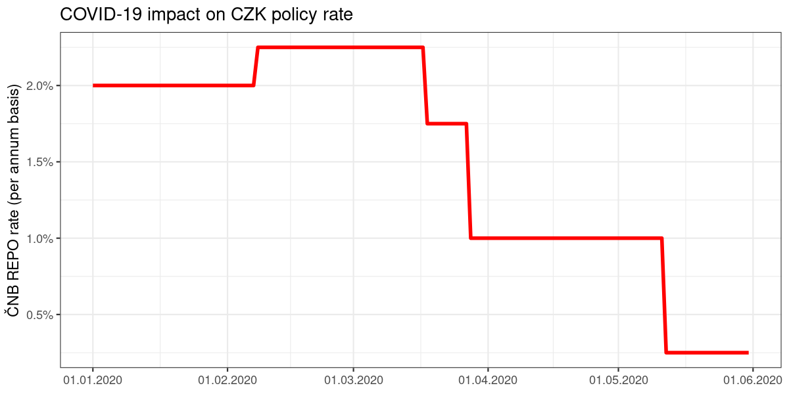

## PRIBOR - PRague InterBank Offered Rate

The PRIBOR rates are provided by ČNB as a courtesy of the Czech Financial Benchmark Facility s.r.o., the benchmark administrator of the PRIBOR benchmark.

The rates can be accessed for internal purposes free of charge via internet pages of the Czech National Bank - https://www.cnb.cz/en/financial-markets/money-market/pribor/format-of-the-pribor-rate-on-the-cnb-website/

The package `{czechrates}` provides a convenient way to access the information stored on the ČNB site from the comfort of your R session. It does not store the rates (this would be against the terms of use, and the data would get stale rather soon). As a consequence a working internet connection is required to use the package.

The `czechrates::pribor()` function has two parameters:

- `date` = date valid for the PRIBOR rate; default is yesterday (`Sys.Date() - 1`)

- `maturity` = tenor of the PRIBOR rate; quoted as one of the standard maturities: 1D (overnight = default), 1W (weekly) and 1M, 2M, 3M, 6M, 9M and 1Y.


```r
library(czechrates)

# PRIBOR: relying on default for both date and tenor
pribor()
## # A tibble: 1 × 2
##   date_valid PRIBOR_1D
##   <date>         <dbl>
## 1 2023-09-07      0.07

# PRIBOR: specific date, default tenor
pribor(as.Date("2020-05-20"))
## # A tibble: 1 × 2
##   date_valid PRIBOR_1D
##   <date>         <dbl>
## 1 2020-05-20    0.0025

# three specific dates + a specific tenor (weekly rate)
three_dates <- as.Date(c("2020-05-11", "2020-05-12", "2020-05-13"))
three_dates
## [1] "2020-05-11" "2020-05-12" "2020-05-13"

pribor(three_dates, "1W")
## # A tibble: 3 × 2
##   date_valid PRIBOR_1W
##   <date>         <dbl>
## 1 2020-05-11    0.0028
## 2 2020-05-12    0.0028
## 3 2020-05-13    0.0028

# PRIBOR: four rates for a single date
pribor(as.Date("2020-05-20"), c("1D", "1W", "1M", "1Y"))
## # A tibble: 1 × 5
##   date_valid PRIBOR_1D PRIBOR_1W PRIBOR_1M PRIBOR_1Y
##   <date>         <dbl>     <dbl>     <dbl>     <dbl>
## 1 2020-05-20    0.0025    0.0027    0.0031    0.0041
```

Using `czechrates::pribor()` you can re-live some of the scariest phases of the Prague interbank market - such as the period around Asian crisis of 1997 (when overnight rates briefly went over 100% on annual basis).


```r
library(czechrates)
library(ggplot2)
library(scales)

offered_rate <- pribor(seq(from = as.Date("1997-05-01"),
                           to   = as.Date("1997-06-30"),
                           by = 1))

ggplot(data = offered_rate, aes(x = date_valid, y = PRIBOR_1D)) +
  geom_line(color = "red", linewidth = 1.25) +
  scale_x_date(date_labels = "%d.%m.%Y") +
  scale_y_continuous(labels = percent_format()) +
  theme_bw() +
  labs(title = "A ghost of rates past...",
       y = "Overnight PRIBOR (per annum basis)") +
  theme(axis.title.x = element_blank())
```

<div class="figure" style="text-align: center">

<p class="caption">plot of chunk asian-fever</p>
</div>

## Two-week Repo Rate

The two-week repo rate (a key policy rate) is set directly by ČNB and also published on the ČNB internet – https://www.cnb.cz/en/faq/How-has-the-CNB-two-week-repo-rate-changed-over-time/

The `czechrates::repo2w()` function has but a single parameter (as maturity is by definition two weeks):

- `date` = date valid for the two week repo rate; default is yesterday (`Sys.Date() - 1`)


```r
# two-week REPO rate for yesterday
repo2w()
## # A tibble: 1 × 2
##   date_valid REPO_2W
##   <date>       <dbl>
## 1 2023-09-07    0.07

# two-week REPO rate for three specific dates (as defined in the PRIBOR section)
repo2w(three_dates)
## # A tibble: 3 × 2
##   date_valid REPO_2W
##   <date>       <dbl>
## 1 2020-05-11  0.01  
## 2 2020-05-12  0.0025
## 3 2020-05-13  0.0025
```

To illustrate the development of the main policy rate – i.e. `czechrates::repo2w()` – we can consider a more recent history:


```r
library(czechrates)
library(ggplot2)
library(scales)

policy_rate <- repo2w(seq(from = as.Date("2020-01-01"),
                          to   = as.Date("2020-05-31"),
                          by = 1))

ggplot(data = policy_rate, aes(x = date_valid, y = REPO_2W)) +
  geom_line(color = "red", linewidth = 1.25) +
  scale_x_date(date_labels = "%d.%m.%Y") +
  scale_y_continuous(labels = percent_format()) +
  theme_bw() +
  labs(title = "COVID-19 impact on CZK policy rate",
       y = "ČNB REPO rate (per annum basis)") +
  theme(axis.title.x = element_blank())
```

<div class="figure" style="text-align: center">

<p class="caption">plot of chunk recent-development-ir</p>
</div>


## ČNB FX rates

The Czech National Bank publishes a list of CZK exchange rates daily. ČNB does not actually trade at these rates, but they are immensely influential. It is "the" official exchange rate, mandated for use in accounting, tax and customs purposes.

The rates are available on CNB website: https://www.cnb.cz/cs/financni-trhy/devizovy-trh/kurzy-devizoveho-trhu/kurzy-devizoveho-trhu/

The `czechrates::cnbfxrate()` function has two parameters:

- `date` = date valid for the FX rate; default is yesterday (`Sys.Date() - 1`)

- `specific_currency` ISO Code of currency, default is "ALL" / meaning a complete list of FX rates quoted for a given day

As some currencies are not quoted per single unit (e.g. Indonesian rupiah is quoted per 1000 IDR, and Hungarian forint per 100 HUF) the function returns not only the rate, but also quoted amount per currency.


```r
# complete list of ČNB FX rates for yesterday
cnbfxrate()
## # A tibble: 31 × 4
##    date_valid currency_code amount  rate
##    <date>     <chr>          <dbl> <dbl>
##  1 2023-09-07 AUD                1 14.5 
##  2 2023-09-07 BGN                1 12.5 
##  3 2023-09-07 BRL                1  4.57
##  4 2023-09-07 CAD                1 16.7 
##  5 2023-09-07 CHF                1 25.5 
##  6 2023-09-07 CNY                1  3.11
##  7 2023-09-07 DKK                1  3.27
##  8 2023-09-07 EUR                1 24.4 
##  9 2023-09-07 GBP                1 28.4 
## 10 2023-09-07 HKD                1  2.90
## # ℹ 21 more rows

# EUR/CZK rate for three specific dates (as defined in the PRIBOR section)
cnbfxrate(three_dates, "EUR")
## # A tibble: 3 × 4
##   date_valid currency_code amount  rate
##   <date>     <chr>          <dbl> <dbl>
## 1 2020-05-11 EUR                1  27.6
## 2 2020-05-12 EUR                1  27.4
## 3 2020-05-13 EUR                1  27.4
```


For a graphic overview we can consider the EUR/CZK rate over the same period as for the main policy interest rate:


```r
library(czechrates)
library(ggplot2)
library(scales)

euro_rate <- cnbfxrate(seq(from = as.Date("2020-01-01"),
                           to   = as.Date("2020-05-31"),
                           by = 1),
                       "EUR")

ggplot(data = euro_rate, aes(x = date_valid, y = rate)) +
  geom_line(color = "red", linewidth = 1.25) +
  scale_x_date(date_labels = "%d.%m.%Y") +
  scale_y_continuous(labels = dollar_format(prefix = "",
                                            suffix = " CZK",
                                            accuracy = 1/100)) +
  theme_bw() +
  labs(title = "COVID-19 impact on CZK exchange rate",
       y = "ČNB EUR/CZK FX rate") +
  theme(axis.title.x = element_blank())
```

<div class="figure" style="text-align: center">

<p class="caption">plot of chunk recent-development-fx</p>
</div>
